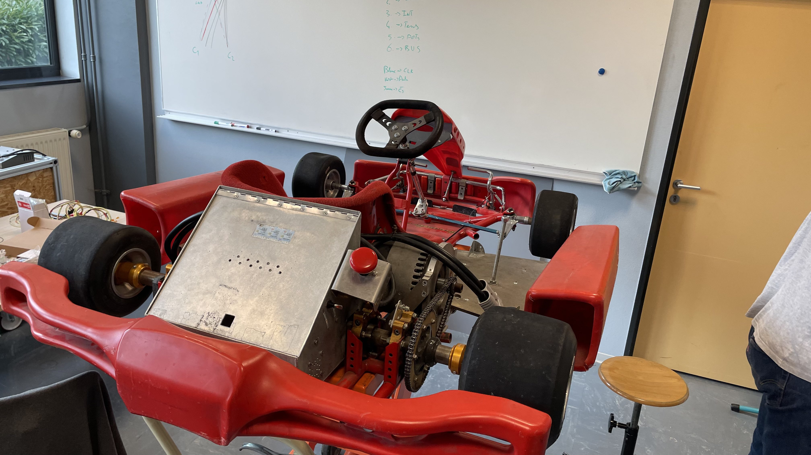
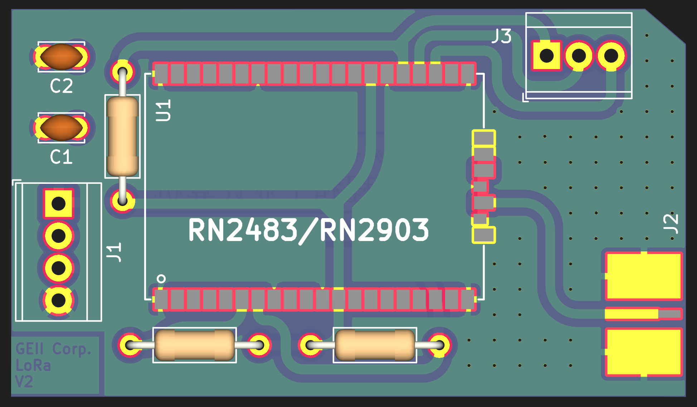
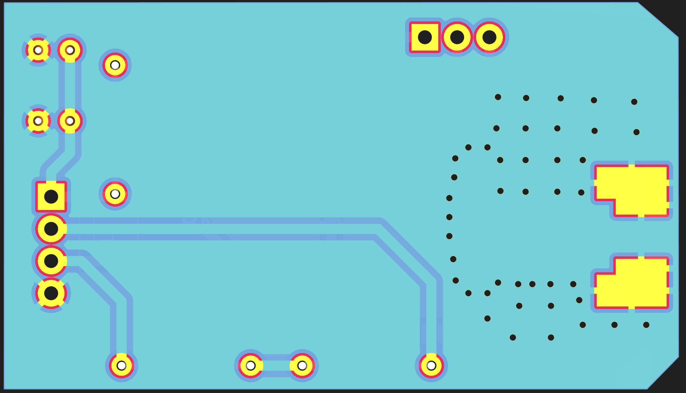
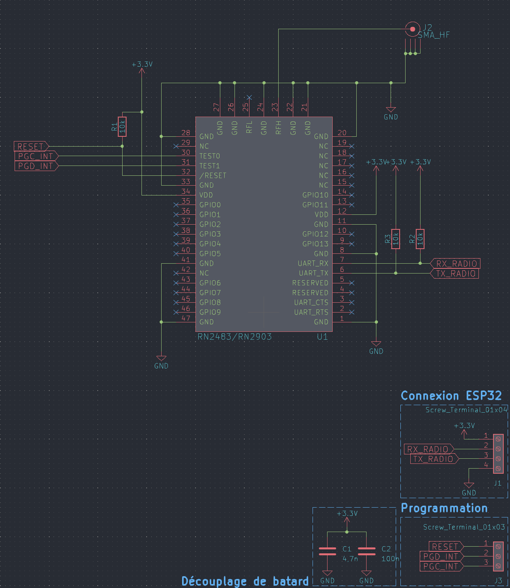
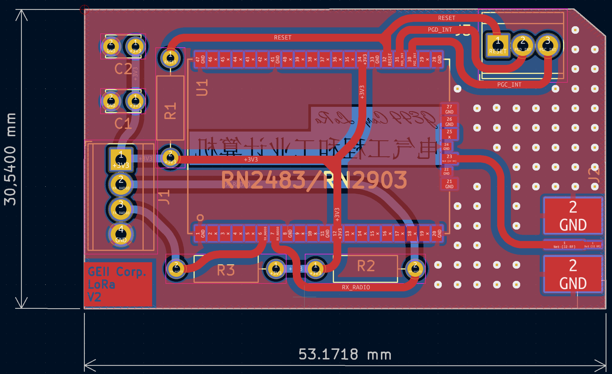
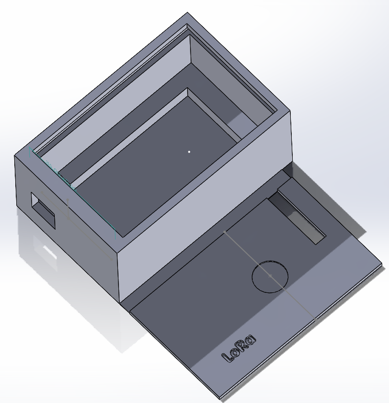
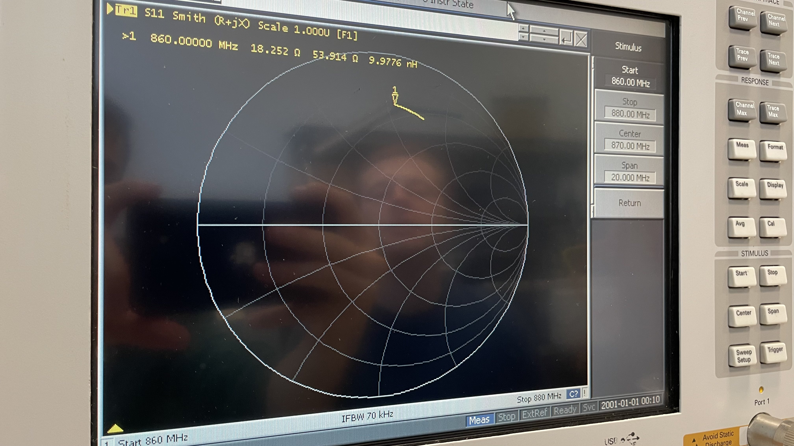
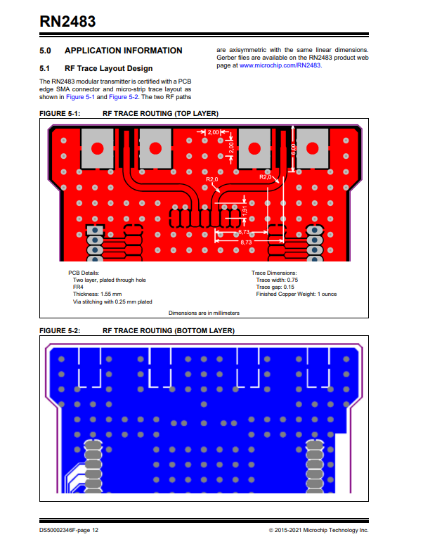
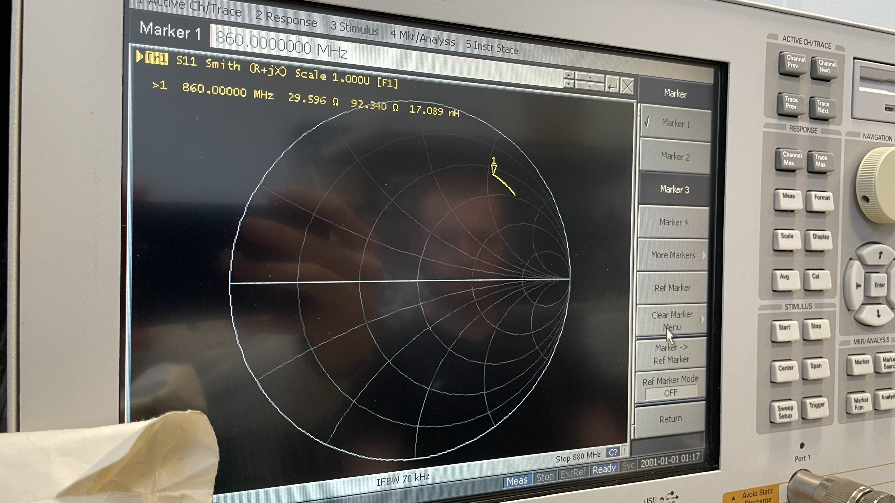

# SAE-KART LoRa

Simple KiCad design for an Arduino compatible RN2483 (or RN2903) LoRaWA suited for our Project.

Fork of the original [jpmeyers/RN2483shield](https://github.com/jpmeijers/RN2483shield).

***Top board view***

***Bottom board view***

Adjusted to:

 * ignore the 433MHz antenna trace (868MHz only),
 

## Required Parts for PCB

 * 3× 10k resistors,
 * 1× SMA 868MHz antenna,
 * 1x RN2483 (or RN2903)

## Setting up

WIP
-debug possible

## Schematic

***Schematic***

***PCB***

## Solidworks Case

***Solidworks view***

## RF Impedance Analyser Results

The first version was a bit off, because we didn't follow the [LoRa Module](https://ww1.microchip.com/downloads/aemDocuments/documents/OTH/ProductDocuments/DataSheets/RN2483-Low-Power-Long-Range-LoRa-Technology-Transceiver-Module-DS50002346F.pdf), where we have application information for better transmission.

***[Datasheet P.12](https://ww1.microchip.com/downloads/aemDocuments/documents/OTH/ProductDocuments/DataSheets/RN2483-Low-Power-Long-Range-LoRa-Technology-Transceiver-Module-DS50002346F.pdf)***

After 

## Final result

WIP
***Final result***

