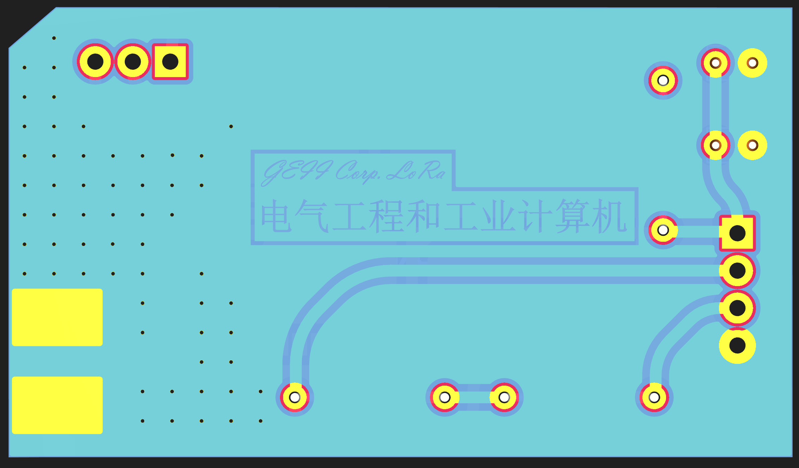
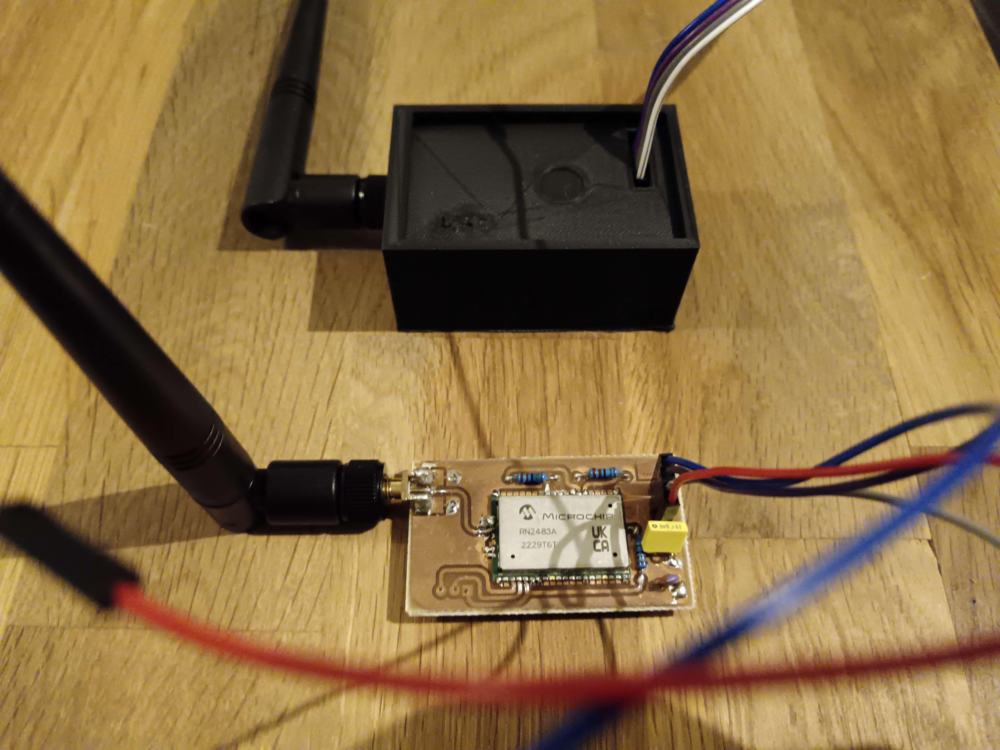
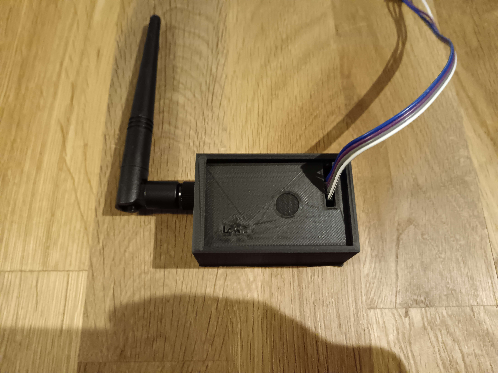
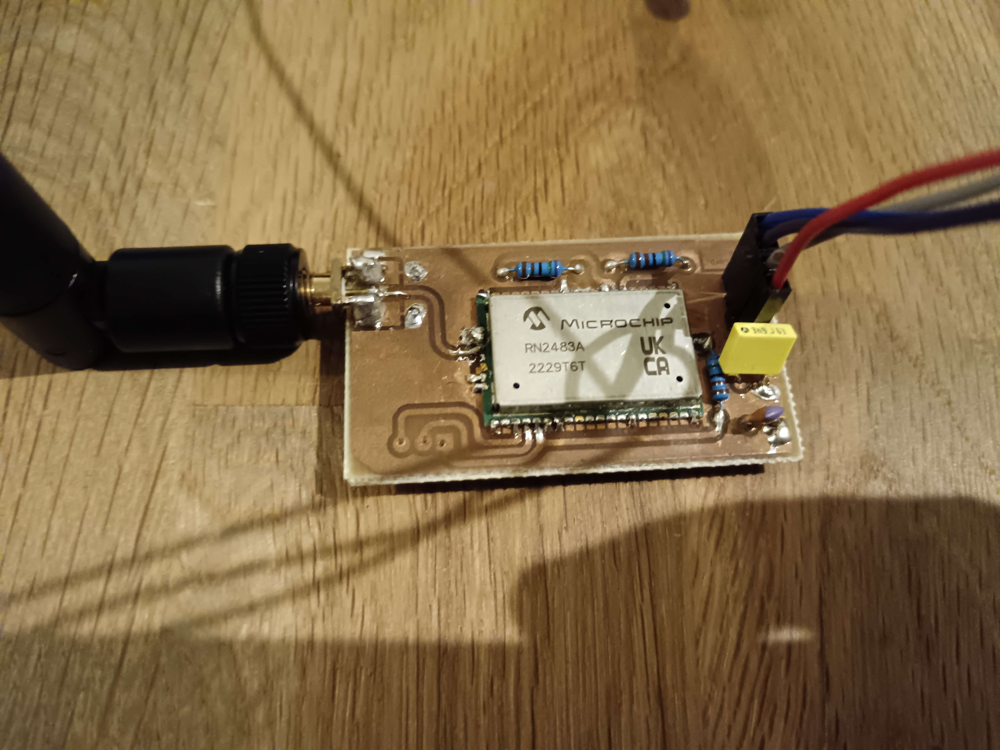
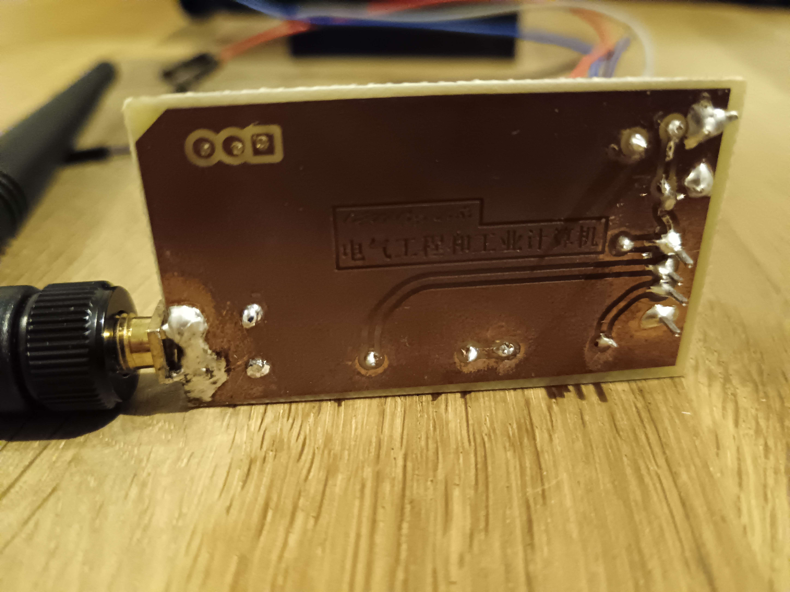
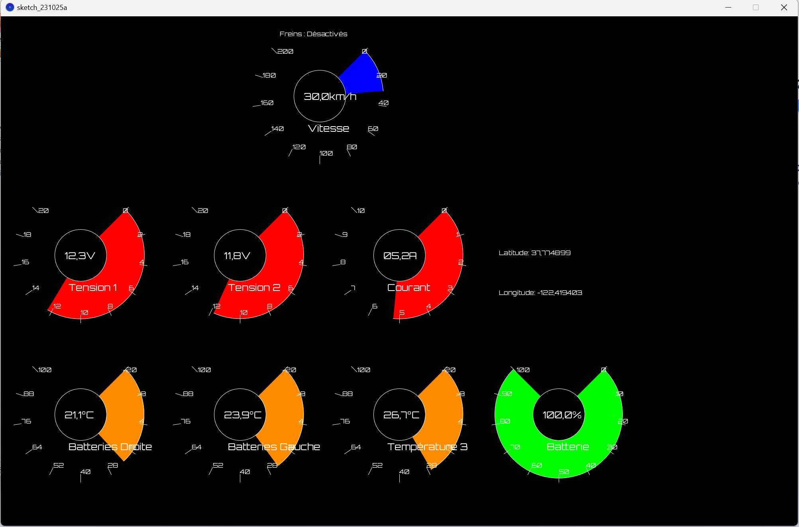

# SAE-KART 

Supervision d'un Kart

## Programme ESP32

### Roadmap

- Intégrer les modules testés et validés individuelement dans un même programme principal (main)

- Utilisation d'un module I2C pour la communication UART du module GPS.

- Fix les modules

### Avancée

|    Module     |     Test      |     Notes     |
| ------------- | ------------- |              -|
| MAIN ESP32    | ✅           |Terminé fonctionnel    |
| Dual Core     | ✅           |Terminé fonctionnel (1 loop/coeurs (2) )   |
| GPS           | ✅           |Terminé fonctionnel    |
| Module Lora   | ✅           |Terminé fonctionnel    |
| écran         | ✅           |Terminé fonctionnel    |
| Accel/frein   | ✅           |Terminé fonctionnel    |
| Shift register| ✅           |Terminé fonctionnel    |
| Capteur temperature|🟨       |Manque capteur temp moteur |
| I2C TO UART   | ✅           |Terminé fonctionnel    |
| Capteur fréquence| ✅  |Terminé fonctionnel   |

## SAE-KART LoRa
Simple KiCad design for an Arduino compatible RN2483 (or RN2903) LoRaWA suited for our Project.

Fork of the original [jpmeyers/RN2483shield](https://github.com/jpmeijers/RN2483shield).

***Top board view***

***Bottom board view***

Adjusted to:

 * ignore the 433MHz antenna trace (868MHz only),
 

### Required Parts for PCB

 * 3× 10k resistors,
 * 1× SMA 868MHz antenna,
 * 1x RN2483 (or RN2903)

### Setting up

WIP
-debug possible

### Schematic

***Schematic***

***PCB***

## Solidworks Case

***Solidworks view***

### RF Impedance Analyser Results

>(R +jX) - Calibrated with 50ohms

> The first version was a bit off, because we didn't follow the [LoRa Module Datasheet](https://ww1.microchip.com/downloads/aemDocuments/documents/OTH/ProductDocuments/DataSheets/RN2483-Low-Power-Long-Range-LoRa-Technology-Transceiver-Module-DS50002346F.pdf), where we have application information for better transmission.
Tiny holes are for [via stitching](https://www.altium.com/documentation/altium-designer/via-stitching-via-shielding-pcb) 

***[Datasheet P.12](https://ww1.microchip.com/downloads/aemDocuments/documents/OTH/ProductDocuments/DataSheets/RN2483-Low-Power-Long-Range-LoRa-Technology-Transceiver-Module-DS50002346F.pdf)***

In the end after testing we are getting better results, better signal strenght and range. So we are certainly closer for a better impedance, but it could be better as the Analyser retrieved us with not perfect transmision Impedence (29.5 +j*92.3) 
## Final result

***Final result***
## Processing 

Despite the use of an LCD arduino screen, we wanted to add a better gauge interface, more customizable so we tried to use processing.
A first sketch code has been written, using an raspberry pi with a raspberry 7" screen.

